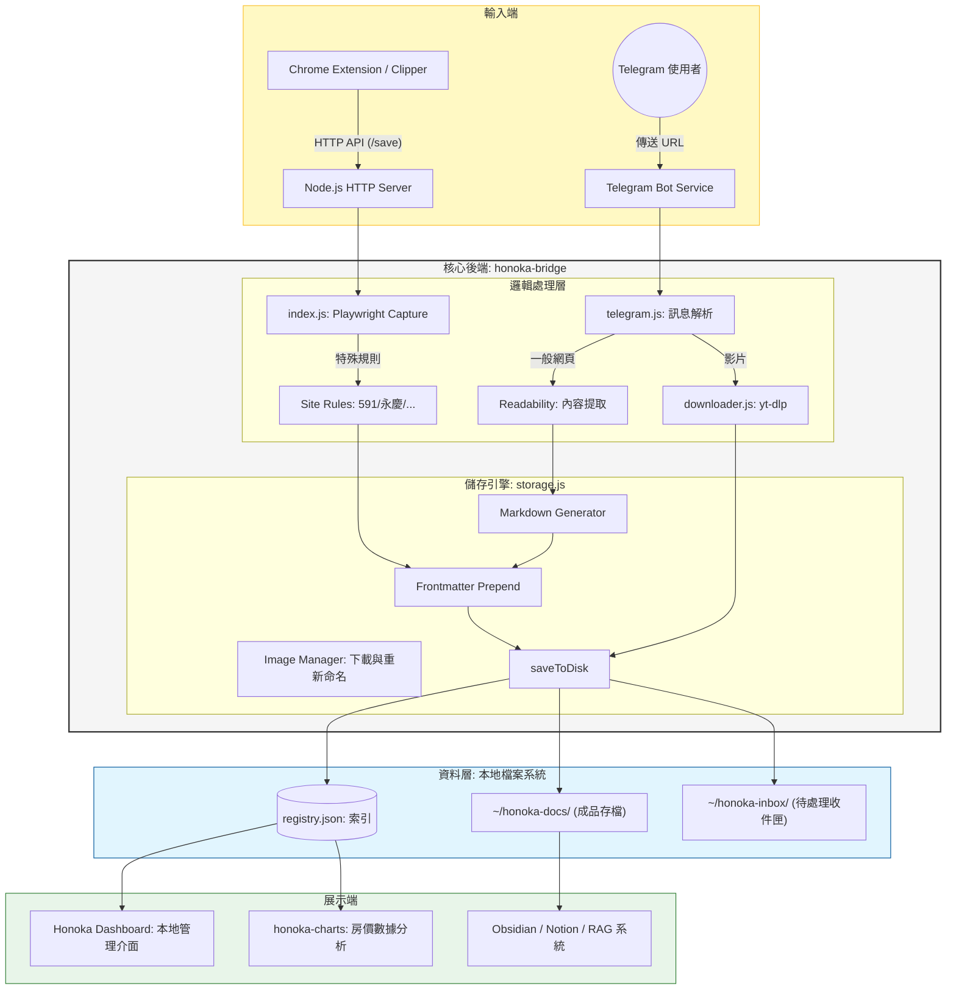

# House Loan & Honoka Lite Project

這是一個整合了房屋貸款研究、個人知識庫與 AI 輔助工具的綜合型專案。

## 專案核心模組

### 1. Honoka Lite (Chrome 擴充功能與 Bridge 伺服器)
這是一個位於 `honoka-lite/` 的個人化知識庫擷取工具，包含：
- **視覺剪輯器 (Visual Clipper)**：移植自 MaoXian 的網頁內容選取功能，支援多區塊選取、圖片自動下載與 Markdown 格式化。
- **動態 Port 橋接 (Bridge Server)**：透過 Node.js 執行的背景服務，自動將網頁內容存入本地 `~/honoka-docs` 目錄。
- **環境自適應**：自動偵測環境 (Lite vs Company) 並切換通訊埠 (44124 vs 7749)。
- **自動化擷取 (📸 Capture)**：支援透過 Playwright 自動捲動網頁並生成全長截圖 (PNG) 與 PDF 存檔。

### 2. 房屋貸款追蹤 (Budget & Loan Tracking)
位於 `Budget track/` 的財務紀錄與分析文件。

### 3. 文件與協議 (Docs)
- **QA-Protocol.md**：專案開發與同步的品質保證標準。
- **Honoka Upgrade Guide** (位於 `doc4/`)：Lite 版新功能合併至公司專案的指引。

---

## 系統架構 (System Architecture)

Honoka 是一個整合了多端輸入與自動化處理的知識管理系統，其核心運作流程如下：



---

## 快速開始 (Honoka Lite)

### Linux 環境
1. **安裝 Bridge 伺服器**：
   ```bash
   cd honoka-lite
   ./install-linux.sh
   ```
   這會將 Bridge 註冊為 `systemd` 服務並設定為 `Restart=always`。現在你可以直接透過 Honoka 介面上的 **Restart Bridge** 按鈕來重啟服務。

### Windows 環境
1. **執行 Bridge 伺服器**：
   在 `honoka-lite/honoka-bridge` 目錄下執行：
   ```cmd
   node index.js
   ```
2. **自動重啟建議**：
   Windows 預設不支援 systemd。若要讓介面上的 **Restart Bridge** 按鈕生效（即程式結束後自動重新啟動），建議建立一個 `.bat` 檔來執行：
   ```cmd
   :start
   node index.js
   goto start
   ```

### 安裝 Chrome 擴充功能 (跨平台通用)
1. 開啟 Chrome 進入 `chrome://extensions`。
2. 啟動「開發者模式」。
3. 「載入解壓縮的擴充功能」，選擇 `honoka-lite/chrome-extension`。

---

## Telegram Bot 設定指引

Honoka Bridge 內建了 Telegram Bot 整合功能，讓你只需發送網址給 Bot，系統就會自動爬取內容並存檔。

### 1. 填入 Bot Token (推薦方式)
你可以直接透過 Honoka 的網頁設定介面填入：
- **網址：** [http://127.0.0.1:44124/settings](http://127.0.0.1:44124/settings)
- 在 **Telegram Bot Token** 欄位填入你從 @BotFather 取得的 Token。
- 在 **Telegram Allowed User** 填入你的 Telegram ID 以確保安全性。

### 2. 手動編輯設定檔
設定資訊持久化存儲於你的家目錄中：
- **路徑：** `~/.honoka-docs/.honoka/settings.json`
- **格式：**
  ```json
  {
    "telegramBotToken": "你的_TOKEN_在這裡",
    "telegramAllowedUser": "你的_ID"
  }
  ```

---

## 開發規範
所有代碼異動必須遵循 `docs/QA-Protocol.md`，特別是環境判定必須依賴 `manifest.name` 而非版本號。

---

## 更新紀錄 (Change Log)

### v1.4.6 (2026-04-30)
- **Playwright 自動安裝**：Bridge 會自動偵測並嘗試安裝缺失的瀏覽器核心。
- **房產資料同步強化**：完整對齊 591、永慶等站台的價格、坪數、樓層等元數據寫入 Markdown。
- **檔名解耦合**：不再強行寫死 `index.md`，支援更彈性的存檔命名策略。

### v1.4.4 (2026-04-30)
- **Telegram 自動擷取**：傳送網址給 Bot 時，除了 Markdown，現在會自動觸發 📸 Capture (PNG+PDF)。

### v1.4.2 (2026-04-30)
- **進階房產資料擷取**：針對 591、永慶、大家房屋實作專屬邏輯，繞過 DOM 混淆直接從 `dataLayer` 讀取精準數據。
- **📸 網頁全長擷取**：新增 Playwright 驅動的自動擷取功能，支援自動捲動懶加載 (Lazy-load)。

### v1.4.0 (2026-04-29)
- **控制台影片下載器**：在首頁 (`/`) 新增影片下載介面，支援即時進度追蹤。
- **擴充功能整合**：Extension Popup 新增影片下載分頁。

### v1.3.4 (2026-04-29)
- **通用影片支援**：擴展至 Google Drive (支援繞過下載限制)、YouTube、Bilibili。

### v1.3.2 (2026-04-29)
- **X (Twitter) 影片下載**：整合 `yt-dlp` 支援高畫質 X 影片存檔。

### v1.2.1 (2026-04-28) — 整合 Telegram Bot 與 系統穩定性強化
- **實作 Telegram Bot 整合**：現在可以將網址直接傳給 Telegram 機器人，Bridge 會自動爬取網頁內容。
- **動態 Settings UI**：建立 `/settings` 網頁介面。
- **根治 Bridge 重啟卡死**：強制呼叫 `bot.stopPolling()` 並加入 Force-exit 機制。

(更多歷史紀錄請參閱 `honoka-lite/CHANGELOG.md`)
