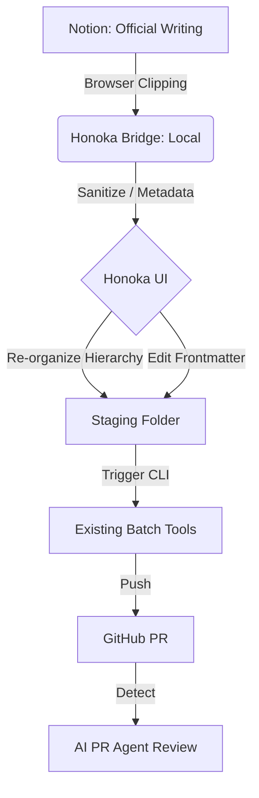
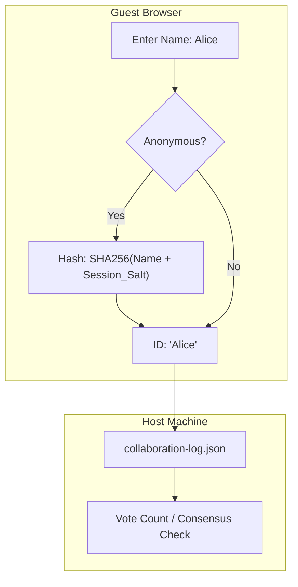

# Notion-to-GitHub Documentation Sync & Management Plan

## Overview
This document outlines the proposed workflow for using **Honoka** as a specialized management and sanitization layer to bridge official company documentation in **Notion** with technical code reviews in **GitHub**.

## 1. Problem Statement
- **Notion** is the official source of truth for design proposals, but lacks Git-integrated review tools.
- **GitHub PR Agents** (like PR-Agent) need localized, sanitized, and well-structured Markdown to provide accurate feedback.
- **Existing Batch Tools** (colleagues' solutions) lack a UI, hierarchy management, and token budget visualization.

## 2. Honoka's Role: The "Management Console"
Honoka will act as a **Virtual Staging Area** between the cloud (Notion) and the repository (GitHub).

### A. Sanitization (脫敏)
- **Local Interception**: Sensitive data (API keys, PII) is stripped or masked within `honoka-bridge` *before* hitting the disk.
- **Custom Filters**: Regex-based automatic detection and manual "Redact" view in the Honoka UI.
- **Zero-Retention Check**: Optional final safety scan using a Zero-Retention LLM provider (e.g., Azure OpenAI) to detect complex patterns without training on the data.

### B. Hierarchy Management (本地編排)
- **Virtual Folders**: Users can drag-and-drop docs in the Honoka UI to redefine hierarchy for the PR context without affecting the original Notion structure.
- **Bundling**: Grouping multiple related Notion pages into a single "Review Bundle" for a specific PR.

### C. Metadata Management (Frontmatter)
Frontmatter serves as the "Identity Card" for the AI Agent.
- `notion_url`: Reference back to the original source.
- `hierarchy_path`: Desired folder structure for GitHub.
- `sanitized`: Boolean flag indicating manual/auto check.
- `review_priority`: High/Medium/Low.
- `token_estimate`: Usage cost for AI processing.

### D. Token Budget Visualization
- Track input/output tokens used by PR Agents or preprocessing.
- Dashboard showing monthly budget remaining and cost per PR.

## 3. Proposed Workflow

## 4. Integration Strategy
Instead of reinventing the GitHub push logic, Honoka will:
1. **Prepare**: Export the cleaned and organized files to a specific directory.
2. **Handoff**: Execute the CLI commands of existing team tools (e.g., `my-batch-tool push --dir ./staging`) via `child_process`.
3. **Notify**: Provide status updates in the Honoka UI (Success/Fail/Rate-limited).

## 5. Security & Risks
- **No-Token Dependency**: By leveraging a browser-based Clipper, we avoid Notion API tokens. *Note: Current clipper is a general web clipper and requires modification to handle Notion's internal block structure.*
- **Zero Cloud Leak**: All sanitization happens on the user's **Local Machine** (Cross-platform).
- **Conflict Resolution**: Honoka tracks `last_sync_time` to warn if the Notion version is newer than the local staged version.

## 6. Local Collaboration & Consensus Protocol
To ensure fairness when the Host (Room Owner) triggers AI actions, Honoka implements a lightweight governance layer:

### A. Pseudo-Authentication & Anonymity
- **Nickname Entry**: Guests enter a name on first join (stored in local session).
- **Anonymous Mode**: Users can toggle "Incognito" for sensitive feedback.

### B. Hashing for Anonymity & Integrity
To protect user privacy while preventing "Sybil attacks" (duplicate voting), Honoka uses a client-side hashing mechanism:

- **Irreversibility**: The Host sees `8f3a...` but cannot mathematically reverse it to "Alice".
- **Integrity**: Each session produces a consistent hash, ensuring one person gets exactly one vote even when anonymous.

### C. Consensus Gates
- **Vote to Refactor**: AI refactoring (e.g., in Cursor) is only "unlocked" after key comments reach a consensus threshold (e.g., 50% approval).
- **Final Sign-off**: A summary of agreed changes must be digitally "initialed" by participants on the Honoka Web UI before the Host can push the final version to GitHub.

### D. Audit Trail
- **Transparency**: Every comment, vote, and sign-off is saved in a local `collaboration-log.json`.
- **Accountability**: This log can be optionally included in the GitHub PR to prove the AI's changes reflect the team's shared intent, not just the Host's preference.

## 7. Action Items
- [ ] Implement `sanitizeContent()` utility in `honoka-bridge/index.js`.
- [ ] Add `hierarchy` and `status` fields to `registry.json`.
- [ ] Create a UI view for "Staging" and "Token Usage".
- [ ] Develop the "Anonymous Voting" (SHA-256) and "Sign-off" UI components.
- [ ] Define the CLI handoff interface for colleagues' tools.
