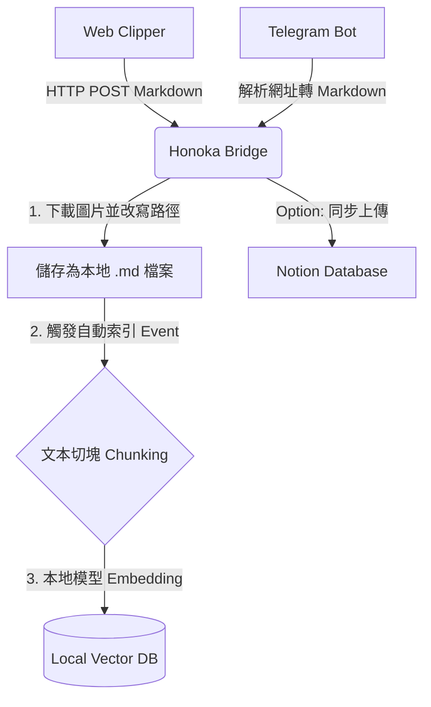

# Honoka Lite 架構與開發路線圖 (Roadmap)

## 專案願景
將原先僅作為 Notion Token 計算的中繼伺服器 (`honoka-bridge`)，升級為一個**「全方位的本地知識處理中樞 (Personal Knowledge Hub)」**。
目標是建立一個能夠無縫攔截來自瀏覽器 (Web Clipper) 與手機端 (Telegram) 的資訊，將其轉化為乾淨的 Markdown 格式並存檔至本地硬碟或 Notion，最後透過**本地向量資料庫 (Vector DB)** 賦予強大的語意搜索 (Semantic Search) 能力。

---

## 核心系統架構

整個系統由四個主要的微服務/模組所構成：

### 1. 前端擷取器 (Web Clipper Extension)
*   **定位**：獨立的 Chrome 擴充功能（基於目前的 `house-loan-clipper`）。
*   **職責**：
    *   在瀏覽器內擷取當前網頁內容，利用 `@mozilla/readability` 提取純淨內文。
    *   利用 `turndown.js` 將 HTML 轉換為 Markdown。
    *   將打包好的 Markdown 與原始圖片網址，透過 HTTP POST 傳送給本機的 `honoka-bridge`。

### 2. 跨平台接收器 (Telegram Bot)
*   **定位**：內建於 `honoka-bridge` 的背景服務。
*   **職責**：
    *   接收來自手機或任何裝有 Telegram 的裝置傳來的網址連結。
    *   自動在背景使用 Node.js (搭配 `puppeteer` 或單純 `axios` + `cheerio`) 去抓取該網址的內容，並轉換為 Markdown。
    *   將處理好的內容送入與 Clipper 相同的處理與存檔管線 (Pipeline)。

### 3. 中央處理中樞 (Honoka Bridge Backend)
*   **定位**：Node.js 本機伺服器 (`localhost:7749`)。
*   **職責**：
    *   **資源下載**：收到 Markdown 後，自動攔截裡面的圖片 URL，透過本機網路將圖片下載到指定的本地資料夾 (如 `~/Documents/Obsidian/assets`)。
    *   **路徑替換**：將 Markdown 內的外部圖片網址 `` 替換為相對應的本地路徑。
    *   **資料儲存**：將最終的 `.md` 檔案寫入本地硬碟，或者透過 Notion API 同步上傳至 Notion Database。

### 4. 語意檢索大腦 (Local Vector DB & Embeddings)
*   **定位**：嵌入於 Node.js 或是獨立運行的輕量級向量庫 (推薦使用 **ChromaDB**, **LanceDB**, 或搭配 **Ollama** 本地運算)。
*   **職責**：
    *   **自動索引 (Auto-Indexing)**：當 Bridge 寫入一篇新的 `.md` 筆記時，觸發 Webhook 或檔案系統監聽 (fs.watch)，將該篇筆記進行文本切塊 (Chunking)。
    *   **向量化 (Embedding)**：利用本地端的 Embedding 模型 (如 `nomic-embed-text` 或 `mxbai-embed-large`) 將文本切塊轉換為向量。
    *   **檢索 (Semantic Search)**：提供一個簡易的搜尋介面或 API，允許你用自然語言直接搜尋過去存下來的所有文章重點。

---

## 資料流與 Vector DB 自動更新機制

為了確保本地 Markdown 筆記與 Vector DB 永遠保持同步，採用以下機制：

**自動更新策略：**
1.  **寫入即索引 (Write-through)**：在 `honoka-bridge` 成功呼叫 `fs.writeFileSync` 儲存 `.md` 檔案後，緊接著呼叫 Embedding 函數將該文章寫入 Vector DB。
2.  **變更監聽 (File Watcher - 選用)**：如果未來你會用 Obsidian 或 Cursor 直接修改那些 `.md` 檔案，可以在 Bridge 中加入 `chokidar` 套件監聽該資料夾，一有檔案存檔變更，就自動重新 Embedding 更新 Vector DB 內的對應 ID。

---

## 圖片儲存策略與 AI 整合 (Image Storage Strategy)

未來若要串接本地 LLM (如 AnythingLLM) 與向量資料庫，**圖片如何被擷取與儲存將是系統成敗的關鍵**。因為多模態 (Multimodal) AI 需要依賴結構良好的本地路徑來讀取圖片，才能正確解析圖文上下文。

### 兩階段圖片擷取策略：
1. **公開圖片 (現行方案)**：
   擴充功能僅收集絕對網址，交由背景的 `honoka-bridge` (Node.js) 發起下載。
   * **優點**：前端擴充功能極度輕量，不佔用瀏覽器記憶體。
   * **缺點**：無法抓取需要「登入權限」的私有圖片（如 Notion、私密社團），因為 Node.js 沒有瀏覽器的 Cookie。
   
2. **私有圖片 (未來升級方案)**：
   升級前端的 `selector.js`，讓擴充功能直接在瀏覽器內抓取圖片並轉換為 **Base64** 或 **Blob** 格式，再傳送給 Bridge。
   * **優點**：利用瀏覽器現有的登入憑證 (Cookie)，完美破解 401 權限限制，所見即所得。
   * **缺點**：網路傳輸封包較大（Base64 體積增加約 33%）。

### AI 讀取最佳實踐：
不管採取哪種擷取策略，最終 Bridge 都必須將 Base64 或網路圖片還原為**實體的本地檔案 (`.png` / `.jpg`)**，並存放在與 Markdown 文件相對應的 `images/` 目錄中。
* AnythingLLM 等本地工具在讀取 Markdown 建立向量索引時，才能透過相對路徑精準定位實體圖片，確保在未來的 Semantic Search 中，AI 能夠正確引用或分析該圖片內容。

---

## 開發路線圖 (Roadmap)

### Phase 1: 基礎擷取與本機儲存 (Web Clipper + Bridge)
*   [ ] 擴充 `honoka-bridge`，新增 `/api/clip` 接收端點。
*   [ ] 實作 Node.js 圖片下載器，能自動儲存圖片並替換 Markdown 圖片路徑。
*   [ ] 完善 `house-loan-clipper`，實作 Readability + Turndown 轉換並打 API 給 Bridge。

### Phase 2: 跨平台輸入 (Telegram Bot 整合)
*   [ ] 申請 Telegram Bot Token。
*   [ ] 於 `honoka-bridge` 內整合 `node-telegram-bot-api`。
*   [ ] 實作網址解析爬蟲，讓 Bot 收到連結能自動轉交給 Phase 1 的處理管線。

### Phase 3: 知識向量化 (Local Vector DB 建置)
*   [ ] 選擇與安裝本地向量引擎（建議直接在 Node 專案中 `npm install @lancedb/lancedb`，不需額外架設伺服器）。
*   [ ] 建立文本切塊工具 (Text Splitter)，將長篇文章切分為 500-1000 tokens 的小段落。
*   [ ] 串接 Ollama 或本地 Transformer 套件生成 Embedding。
*   [ ] 實作「檔案寫入即向量化」的自動掛載流程。

### Phase 4: 檢索介面與應用 (Semantic Search UI)
*   [ ] 開發一個簡單的本地搜尋網頁 (可直接由 `honoka-bridge` 兼任 Web Server 伺服)。
*   [ ] (進階) 串接本地 LLM 進行 Retrieval-Augmented Generation (RAG)，實作「與我的知識庫對話」的功能。
