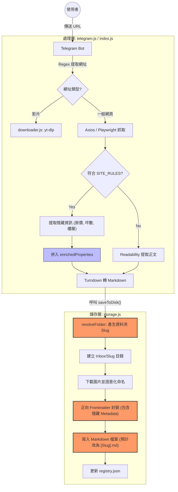

# Honoka Slug Naming 設計與決策

本文件記錄了 Honoka 專案中關於檔案與目錄命名規範（Slug Naming）的設計思維、風險評估與最終決策，旨在取代傳統的 `index.md` 通用命名，強化資料的語意化與可檢索性。

---

## 1. 設計目標 (Goals)

*   **語意化 (Semantic)**：使檔案名稱本身具備辨識度，即使脫離目錄結構也能理解內容。
*   **可溯源性 (Traceability)**：建立文章與圖片資產間的強關聯，便於由圖反查文。
*   **搜尋優化 (SEO/RAG friendly)**：利於 AnythingLLM 等 RAG 系統對檔案進行精準索引。

---

## 2. 命名規範 (Convention)

### 2.1 主文章檔案 (Article Slug)
取代 `index.md`。
*   **格式**：`[YYYY-MM-DD]-[Slugified-Title].md`
*   **範例**：`2026-04-29-cfmoto-papio-xo-1-r-racer.md`
*   **規則**：標題轉小寫、去符號、空格轉連字號 `-`，長度限制於 50 字元內。

### 2.2 圖片資產 (Image Slug)
*   **格式**：`[Article-Slug]-img-[Position].[ext]`
*   **範例**：`2026-04-29-cfmoto-papio-xo-1-r-racer-img-01.jpg`
*   **規則**：序號補零（01, 02），確保排序正確且檔名包含所屬文章語意。

### 2.3 目錄結構
*   **外層目錄**：`[YYYY-MM-DD]-[Slug]` (動態)
*   **內層圖片目錄**：**固定命名為 `images/`**。
*   **優點**：保持 Markdown 內部連結（如 `./images/xxx.jpg`）的簡潔與可移植性。

---

## 3. 風險評估與解決方案 (Risk Assessment)

| 風險項目 | 說明 | 解決方案 |
| :--- | :--- | :--- |
| **路徑過長** | Windows 等系統對路徑長度有限制 (260 char)。 | 限制 Slug 長度 (50 字元)；內層圖片目錄固定叫 `images/` 以節省空間。 |
| **內部連結斷裂** | 目錄改名可能導致圖片失效。 | 強制在 Markdown 中使用 **相對路徑** (`./images/`)，確保資料夾整體的移動性。 |
| **命名衝突** | 相似標題可能產生相同 Slug。 | 延用現有的 `dedup` 邏輯（自動加 `(2)`），或在 Slug 後方附加短 Hash/時間戳。 |
| **索引複雜化** | 每篇文章檔名不同，批次匯入較難處理。 | 1. 建立 `manifest.json` 標記主檔案。<br>2. 在 `registry.json` 中明確紀錄 `filename`。 |

---

## 4. 最終決策架構 (Final Decision)

為了平衡「語意化」與「系統穩定性」，我們決定採用以下折衷方案：

1.  **外層目錄動態化**：方便人類在檔案管理員中快速尋找。
2.  **主檔案動態化**：賦予檔案語意，方便 RAG 系統與全域搜尋。
3.  **圖片目錄固定化**：內部資產資料夾永遠叫 `images/`，簡化程式處理邏輯。
4.  **圖片檔名語意化**：圖片檔案本身包含文章 Slug，解決由圖反查文的索引需求。

---

## 5. 系統架構與流程 (Architecture)

以下為 Honoka 目前從 Telegram 接收網址到儲存內容的邏輯架構，並標註了未來需要升級的關鍵節點（包含針對 591/永慶等站的隱藏資訊提取路徑）：




---

## 6. 版本差異比較 (v1.4.6 vs. Target)

為了達成語意化目標，我們將在下一階段進行以下調整：

| 項目 | v1.4.6 (現狀) | 預期目標 (Target) |
| :--- | :--- | :--- |
| **資料夾命名** | `Title (sanitized)` | `[YYYY-MM-DD]-[Slugified-Title]` |
| **主文章檔案** | 固定為 `index.md` | 與資料夾同名的 `[Slug].md` |
| **圖片檔案** | 隨機碼 `img-1714...png` | 語意化 `[Slug]-img-01.png` |
| **Markdown 連結** | 直接指向 `./images/random.png` | 維持 `./images/` 但對應新檔名 |
| **Frontmatter** | 基本中繼資料 (title, source) | 包含 `article_id`, `slug`, `filename` |
| **RAG 友善度** | 普通 (依賴目錄層級) | 高 (檔案本身具備完整語意) |

---

## 7. Metadata 整合示範

在 Markdown 的 Frontmatter 中應包含以下欄位，特別是透過 `version: 2` 標記架構版本，以便未來進行資料遷移或 AI 邏輯升級：

```yaml
---
version: 2
article_id: "article_20260430_591_house_123"
slug: "2026-04-30-591-xin-yi-district-luxury-house"
filename: "2026-04-30-591-xin-yi-district-luxury-house.md"
source: telegram
category: reference
saved_at: "2026-04-30T17:53:28Z"
url: "https://sale.591.com.tw/home/house/detail/2/1234567.html"
properties:
  price: "4500萬"
  ping: "35.5坪"
  floor: "12F/15F"
  layout: "3房2廳2衛"
  community: "信義之星"
  address: "台北市信義區..."
---
```


